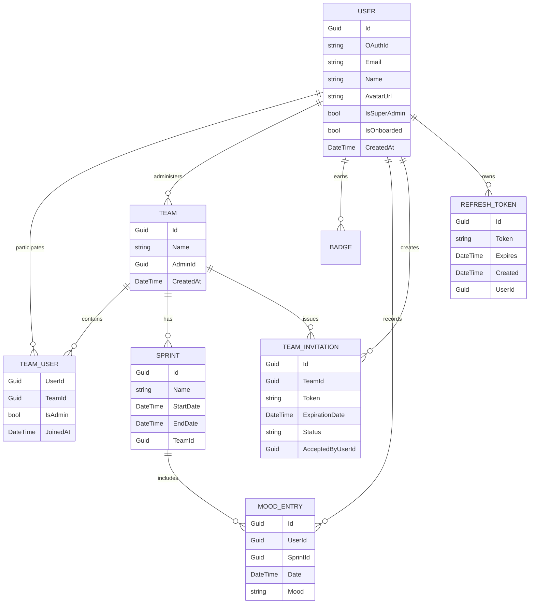
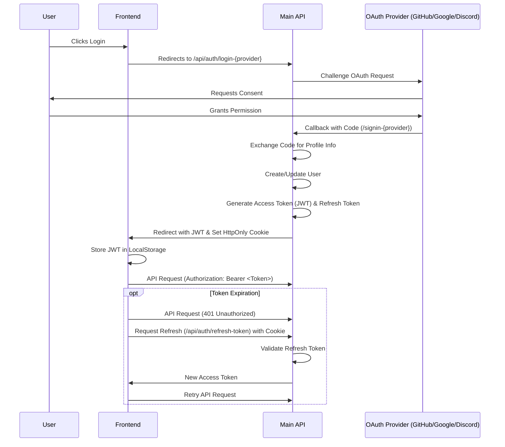

# Niko Niko Calendar - Architecture Documentation

This document describes the technical architecture, data models, and workflows of the Niko Niko Calendar application.

## 1. System Overview

The application follows a distributed architecture composed of several decoupled services orchestrated using Docker.

### Components:
*   **Frontend**: A React 19 application built with TypeScript and Vite. It provides the user interface for tracking morale and managing teams.
*   **Main API**: A .NET 10 Web API handling business logic, authentication, and data persistence.
*   **Notification Service**: A dedicated .NET service for real-time notifications using SignalR.
*   **Database**: Persistent storage using either PostgreSQL (Production) or SQLite (Development/Portable).

---

## 2. Frontend Architecture

### Core Stack
*   **Framework**: React 19 (TypeScript) + Vite
*   **UI Library**: Material UI (MUI v7)
*   **State Management**: `React.Context` (Auth, ColorMode), `SWR` (Data fetching)
*   **Routing**: `react-router-dom`
*   **Date Handling**: `Day.js` for consistent date formatting and arithmetic.

### Internationalization (i18n)
The application supports multiple languages (English and French) with a centralized management system.
*   **Library**: `i18next` / `react-i18next`.
*   **Configuration**: `src/i18n/config.ts`.
*   **Storage**: Translations are stored in JSON files under `src/i18n/locales/`.
*   **Detection**: `i18next-browser-languagedetector` automatically detects user preference.
*   **Date Formatting**: `Day.js` locales are dynamically updated based on the selected language.

---

## 3. Backend Architecture (.NET 10)

The backend is architected following the **Skinny Controller** pattern to ensure maintainability and testability.

### Layers:
*   **API Layer (NikoNiko.Api)**: Handles HTTP concerns (routing, input binding, status codes).
*   **Business Logic Layer (NikoNiko.Services)**: Contains the concrete implementations of business logic and validations.
*   **Core Layer (NikoNiko.Core)**: Defines DTOs, domain models, and service interfaces.
*   **Data Layer (NikoNiko.Data)**: Manages data access via Entity Framework Core, including migrations and database-specific configurations (PostgreSQL/SQLite).

---

## 4. Database Schema

The following diagram illustrates the core data models and their relationships.

---

## 5. Authentication & Security

Authentication is handled via OAuth 2.0 (GitHub/Google/Discord) and secured using JWT (JSON Web Tokens).

### Authentication Workflow:
1.  **OAuth Challenge**: User triggers login via the provider of choice.
2.  **Callback**: After provider consent, the API exchanges the code for profile info.
3.  **Token Generation**: The API generates a short-lived **Access Token** (JWT) and a secure, HttpOnly **Refresh Token**.
4.  **Authorization**: Subsequent requests include the Bearer token in the `Authorization` header.
5.  **Silent Refresh**: When the Access Token expires, the Frontend automatically uses the Refresh Token cookie to obtain a new Access Token.

---

## 6. Real-time Notifications

The application uses SignalR for real-time updates, utilizing **SignalR Groups** to ensure team-isolated broadcasting.

1.  **Connection**: Upon connecting, the user is added to SignalR groups corresponding to their `team_id` claims found in the JWT.
2.  **Team Isolation**: Notifications (like mood submissions) are only broadcast to the specific team group, ensuring users only see updates relevant to their teams.
3.  **Dynamic Membership**: When a user joins or leaves a team, the backend dynamically updates their SignalR group membership.

---

## 7. Development Standards

### Date Handling
*   **Calendar Dates (Sprints, Birthdays)**: Stored as `DateTime` at Midnight UTC (`DateTime.SpecifyKind(date.Date, DateTimeKind.Utc)`).
*   **Point-in-Time (Logs, Events, MoodEntries)**: Stored as True UTC (`DateTime.UtcNow`).

### Code Style
*   **Backend**: Adheres to `.editorconfig` rules; formatted via `dotnet format`.
*   **Frontend**: Formatted via `Prettier` and linted via `ESLint`. Uses Material UI path imports for bundle optimization.
*   **Planning**: All implementation plans are written in Markdown and strictly in English.
