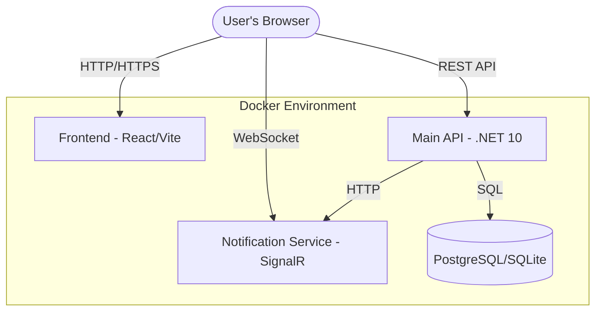
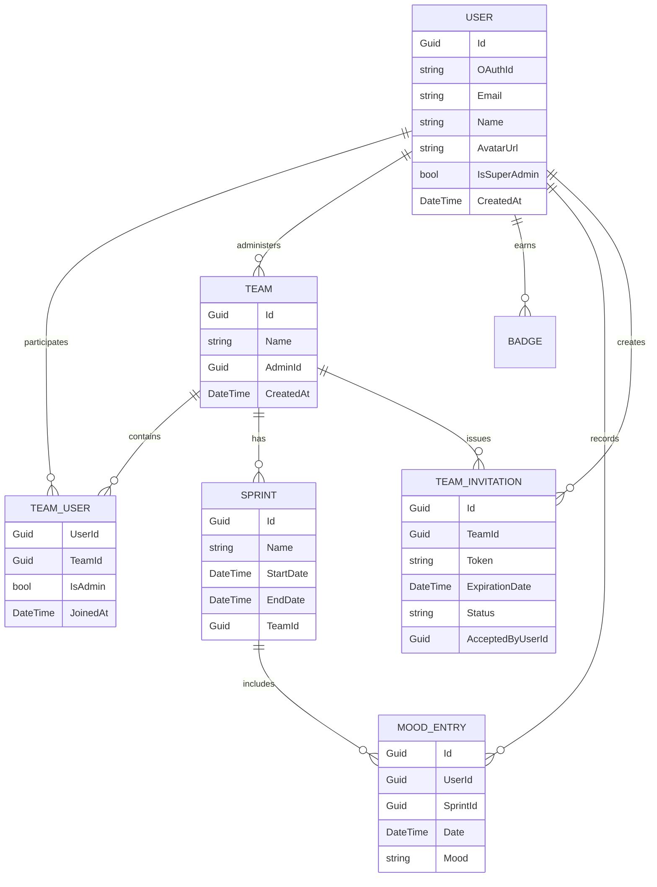
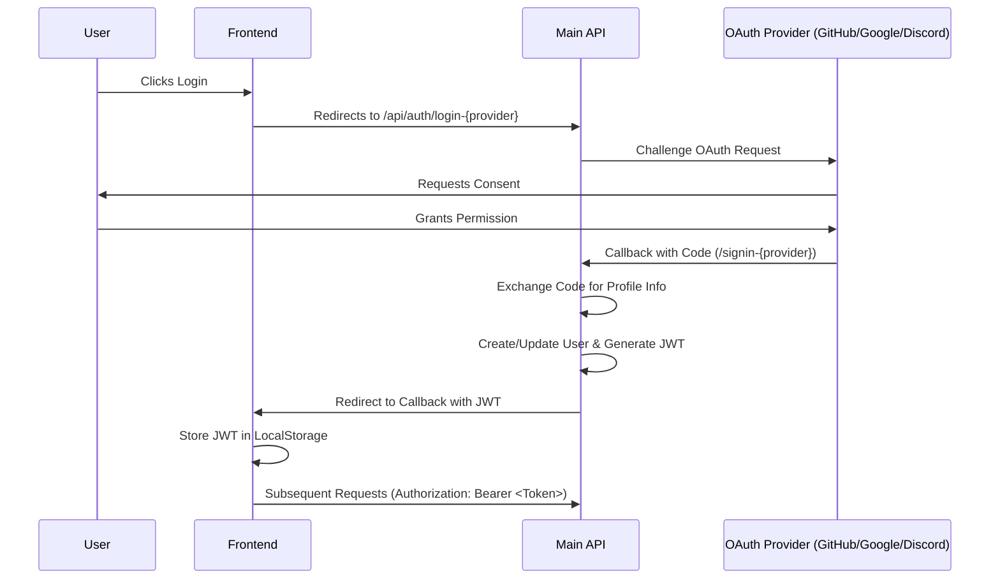

# Niko Niko Calendar - Architecture Documentation

This document describes the technical architecture, data models, and workflows of the Niko Niko Calendar application.

## 1. System Overview

The application follows a distributed architecture composed of several decoupled services orchestrated using Docker.

### Components:
*   **Frontend**: A React 19 application built with TypeScript and Vite. It provides the user interface for tracking morale and managing teams.
*   **Main API**: A .NET 10 Web API handling business logic, authentication, and data persistence.
*   **Notification Service**: A dedicated .NET service for real-time notifications using SignalR.
*   **Database**: Persistent storage using either PostgreSQL (Production) or SQLite (Development/Portable).

---

## 2. Frontend Architecture

### Core Stack
*   **Framework**: React 19 (TypeScript) + Vite
*   **UI Library**: Material UI (MUI v7)
*   **State Management**: `React.Context` (Auth, ColorMode), `SWR` (Data fetching)
*   **Routing**: `react-router-dom`

### Internationalization (i18n)
The application supports multiple languages (currently English and French) with a centralized management system.
*   **Library**: `i18next` / `react-i18next`.
*   **Configuration**: `src/i18n/config.ts`.
*   **Storage**: Translations are stored in JSON files under `src/i18n/locales/`.
*   **Detection**: `i18next-browser-languagedetector` automatically detects user preference.
*   **Date Formatting**: `Day.js` locales are dynamically updated based on the selected language.

---

## 3. Database Schema

The following diagram illustrates the core data models and their relationships.

---

## 4. Authentication Workflow

Authentication is handled via OAuth 2.0 (GitHub/Google/Discord) and secured using JWT (JSON Web Tokens).

---

## 5. Real-time Notifications

The application uses SignalR for real-time updates (e.g., when a team member submits their mood).

1.  **Subscription**: The Frontend connects to the `NotificationHub` in the `NikoNiko.Notifications` service.
2.  **Trigger**: When an action occurs in the `Main API` (e.g., `MoodEntry` created), it sends an internal HTTP request to the `Notifications` service.
3.  **Broadcast**: The `Notifications` service broadcasts the message to the relevant connected clients.

---

## 6. API Standards

The API is built following RESTful principles:
*   **Documentation**: Automatically generated via OpenAPI/Swagger. Accessible at `/swagger` in development.
*   **Formats**: JSON for request and response bodies.
*   **Security**: Most endpoints require a valid JWT passed in the `Authorization` header.
*   **Versioning**: Current endpoints are under `api/`.